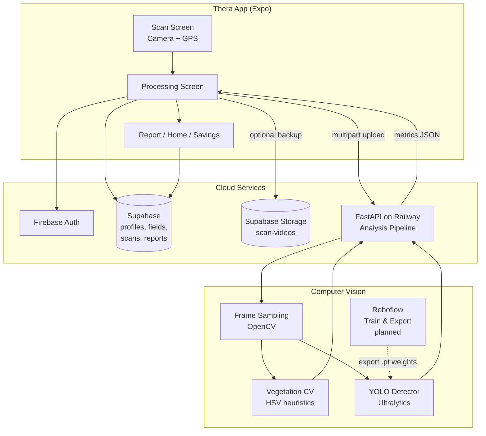

# Thera — Product & Technical Overview

*Last updated: June 2026*

## What Thera Is

**Thera** is a mobile crop scouting app for farmers. The tagline is **"Treat only what needs treatment."**

The core idea: a farmer walks a field with their phone, records video along crop rows, and Thera turns that walk into an AI field report — weed pressure, crop stress, health score, targeted spray recommendations, and estimated chemical savings vs. spraying the whole field.

Thera is aimed at **precision agriculture for row crops** (corn, soybeans, wheat, etc.). It helps farmers:

- Scout fields faster than walking and eyeballing alone
- Quantify weed and stress coverage as percentages
- Recommend **targeted spray acres** instead of full-field application
- Track scan history, field health over time, and season savings

The product is designed as a **consumer-grade mobile app** (React Native / Expo) backed by cloud auth, database, storage, and a dedicated **video analysis API**.

---

## Tech Stack (Today)

| Layer | Technology |
|--------|------------|
| Mobile / Web app | React Native (Expo SDK 56), TypeScript |
| Auth | Firebase Authentication (email/password) |
| Database & storage | Supabase (Postgres + Storage) |
| Analysis API | Python FastAPI on Railway |
| Web hosting | Vercel (Expo web build) |
| Computer vision | OpenCV (vegetation segmentation) + Ultralytics YOLO (optional) |
| Design | Figma Make prototype → implemented UI |

Primary brand color: `#1B6B38` (agricultural green).

---

## Where the App Is Today

### Fully built and working

**Authentication & onboarding**

- Splash → Login / Sign Up / Forgot Password (OTP via Cloud Functions)
- Two-step onboarding after signup:
  1. **Farm Profile** — farm name, region, default crop, units, acreage
  2. **Farmer Background** — birthday, age, years farming, field count, main crop, pesticide brand, role, goals
- Profile data syncs to Supabase `profiles`

**Farm & field management**

- Multi-farm support (`farms` table + farm switching)
- Fields list with crop type, acreage, health status, last scan date
- Fields, scans, and reports sync to Supabase (not just local device storage)
- Edit Profile in Settings (name, email, farm details, farmer background)

**Scanner (real, not mock)**

- Native (iOS/Android): `expo-camera` live preview + video recording
- Web (Vercel): browser camera via `MediaRecorder`
- GPS track recorded during scan (`expo-location`)
- Minimum recording length: 3 seconds
- Full-screen camera on scan screen

**Processing pipeline**

- Upload scan video to Supabase `scan-videos` bucket **or** send directly to analysis API as multipart upload
- Calls Railway analysis API when `EXPO_PUBLIC_ANALYSIS_API_URL` is configured
- Creates a **Report** with real metrics when the API succeeds
- Updates field health score, open issues, savings totals
- Falls back to **estimated/mock report** if the analysis server is unreachable

**Dashboards & reports**

- Home dashboard with field summaries and savings highlights
- Report screen shows weed %, stress %, health score, issues, spray acres, savings
- Reports list, field detail, timeline charts from completed scans
- Savings screen aggregates spray-area reduction across scans

**Backend analysis service**

- Deployed FastAPI service (`backend/`) on Railway
- Endpoints: `GET /health`, `POST /v1/scans/analyze`, `POST /v1/scans/analyze/upload`
- Firebase token or API-key auth
- Frame sampling + CV analysis + optional YOLO blending

**Infrastructure**

- Supabase migrations for profiles, farms, fields, scans, reports, scan video storage, farmer background columns
- CORS configured for Vercel web app
- Local notifications (scan complete, tips, weekly digest toggles in Settings)

### Partially built / placeholder

| Feature | Status |
|---------|--------|
| **Field map** | UI with layer toggles (Weeds, Stress, Spray Zones, Scan Path) — **static SVG mock**, not tied to GPS or real detections |
| **Analysis accuracy** | Default mode is **color-based heuristics**, not a trained ag model |
| **YOLO model** | Code supports custom `.pt` weights via `THERA_YOLO_WEIGHTS`, but **no production model is deployed yet** |
| **Spray zone polygons** | Derived from field acreage × weed %, not from per-pixel/per-frame detections |
| **Billing / subscriptions** | UI screen exists; no real payment integration |
| **Cost assumptions** | Settings structure exists; personalized chemical cost math is basic |
| **Roboflow** | **Not integrated in code yet** — planned path for model training (see below) |

### Recently fixed / in progress

- Farmer background onboarding flow and Supabase persistence
- Navigation bug where Continue on farmer background didn't reach Home
- Email editable in Edit Profile (with password re-auth)
- Scan pipeline stability (stale state, web video upload, CORS to Railway)

---

## What Still Needs to Be Done

### Priority 1 — Make analysis trustworthy (core product value)

1. **Train and deploy a real weed/crop/stress detection model** (Roboflow → YOLO — see below)
2. **Validate analysis** on real field videos across crops and lighting conditions
3. **Replace or demote vegetation CV** once the trained model is reliable
4. **Return spatial data** — bounding boxes or segmentation masks per frame, mapped to GPS for real spray zones

### Priority 2 — Connect analysis to maps

5. **Geo-referenced field map** — overlay detections on scan path using GPS track + frame timestamps
6. **Real spray zone polygons** instead of static SVG placeholders
7. **Field boundaries** — draw or import boundaries so acreage calculations are spatially accurate

### Priority 3 — Product polish & growth

8. **Subscription billing** (Stripe or similar) for Pro/Enterprise tiers
9. **Personalized savings** from farmer's actual chemical costs, application rates, pesticide brand
10. **Production hardening** — error monitoring, rate limits, video size limits, model versioning
11. **Native app store builds** — dev client → TestFlight / Play Store
12. **README / docs update** — README still lists backend as "post-MVP" though it exists

---

## How the Scanner Works

### User flow

```
Home → Scan tab → Select field → Confirm → Record video while walking → Stop
  → Processing screen → Analysis API → Report → Field Map / Timeline / Savings
```

### Recording (mobile app)

1. **Field selection** — user picks a field (must have at least one field created)
2. **Permissions** — camera, microphone (native), and location
3. **Recording** — `CameraView.recordAsync()` on native; `MediaRecorder` on web
4. **While recording**:
   - Timer and progress UI
   - GPS points collected (`latitude`, `longitude`, `timestamp`, `accuracy`)
   - Video saved locally (`Documents/scans/` on native; blob URL on web)
5. **Stop** — if ≥ 3 seconds, creates a `Scan` with:
   - `videoUri`, `videoDurationSeconds`, `gpsTrack`, `recordedAtMs`
   - Status: `uploading` → navigates to Processing

### Processing pipeline

```
ProcessingScreen
  ├─ (optional) Upload video → Supabase scan-videos/{userId}/{scanId}.mp4
  ├─ POST analysis request → Railway FastAPI
  │     ├─ /v1/scans/analyze/upload  (multipart: video + JSON payload)  ← most common
  │     └─ /v1/scans/analyze         (JSON only, video already in Supabase)
  ├─ Receive metrics → build Report
  ├─ Update Scan (weedCoverage, stressCoverage, healthScore, status: completed)
  ├─ Update Field (healthScore, openIssues, totalSavings, lastScanAt, status)
  └─ Persist to Supabase + local AsyncStorage cache
```

If the analysis API is down or misconfigured, the app runs a **mock analysis step** and generates an estimated report so the UX still completes (with a warning).

### Analysis request payload

Sent from `src/services/scanAnalysis.ts`:

- `scan_id`, `field_id`, `user_id`
- `acreage`, `crop_type`
- `video_duration_seconds`
- `gps_track[]`
- Video file (multipart) or `video_path` (Supabase storage path)

---

## What We Want to Analyze

Thera's analysis goals map directly to **targeted treatment decisions**:

| Metric | Purpose |
|--------|---------|
| **Weed coverage %** | How much of the scanned area has weed pressure |
| **Crop stress coverage %** | Yellowing, wilting, disease, pest damage indicators |
| **Health score (0–100)** | Overall field health composite |
| **Detected issues** | Actionable findings with severity, acres affected, confidence, recommended action |
| **Recommended spray acres** | `field acreage × (weed coverage / 100)` — acres that actually need treatment |
| **Chemical reduction %** | Savings vs. spraying the entire field |
| **Estimated savings ($)** | Rough dollar estimate from spray reduction |
| **Field severity** | `healthy` / `warning` / `critical` for dashboard status |
| **GPS track** | Future: map where problems occurred along the walk path |

### Target detections (model classes)

**Weeds**

- Volunteer crops, broadleaf weeds, grass weeds (pigweed, lambsquarters, thistle, etc.)

**Crop stress**

- Nutrient stress (yellowing), moisture stress (wilting), disease spots, pest damage

**Healthy crop** (implicit)

- Used to compute coverage ratios and exclude non-problem areas from spray recommendations

### Business outcome

The analysis should answer:

> "Which acres need herbicide or intervention, and how much chemical can I avoid spraying on healthy crop?"

That is the foundation for Thera's savings story and precision spray maps.

---

## How the Analysis Program Is Written Today

The analysis service lives in `backend/app/` as a **FastAPI** application.

### Architecture

```
main.py
  └─ POST /v1/scans/analyze/upload
       └─ pipeline.analyze_video_file()
            ├─ vegetation.sample_video_frames()     ← OpenCV frame extraction
            ├─ vegetation.analyze_frame_vegetation()  ← HSV color segmentation (default)
            ├─ yolo_detector.analyze_frames_yolo()  ← optional Ultralytics YOLO
            └─ Build AnalyzeScanResponse (metrics + issues + summary)
```

### Step 1 — Frame sampling (`backend/app/analysis/vegetation.py`)

- Opens video with OpenCV
- Samples up to **24 frames** (configurable via `THERA_MAX_FRAMES`)
- Every **2 seconds** of video (configurable via `THERA_FRAME_INTERVAL_SEC`)
- Crops to the lower ~75% of frame (crop band, excluding sky/hood)

### Step 2 — Vegetation CV (default mode: `vegetation_cv`)

Per frame, converts to HSV and applies color masks:

- **Healthy crop** — green range `(35–85° hue)`
- **Stress** — yellow/brown range
- **Weeds** — darker/greener non-crop pixels, excluding healthy mask

Aggregates mean ratios across frames → `weed_coverage %`, `stress_coverage %`, `health_score`.

This is a **fast baseline**, not ag-specific. It works as a placeholder until a trained model is deployed.

### Step 3 — Optional YOLO blend (`backend/app/analysis/yolo_detector.py`)

If `THERA_YOLO_WEIGHTS` points to an existing `.pt` file:

- Loads model via **Ultralytics YOLO**
- Runs inference on each sampled frame
- Maps class names containing keywords:
  - Weed: `weed`, `volunteer`, `pigweed`, `thistle`, etc.
  - Stress: `stress`, `disease`, `yellow`, `wilting`, `pest`
- Computes bounding-box area ratios per frame
- **Blends** with vegetation CV: **65% YOLO + 35% vegetation** for final weed/stress percentages
- Sets `analysis_mode: "yolo"` in the response

### Step 4 — Report generation (`backend/app/analysis/pipeline.py`)

From coverage percentages:

- `recommended_spray_acres = acreage × (weed_coverage / 100)`
- `chemical_reduction_percent` vs. full-field spray
- `estimated_savings` (heuristic formula)
- **Issues list** — e.g. "Elevated weed pressure" if weed ≥ 8%, "Early crop stress" if stress ≥ 5%
- **Severity** — derived from health score + issue count
- **Summary text** — human-readable paragraph for the report screen

### Response consumed by the app

The mobile app maps the API response in `src/services/scanAnalysis.ts` → `ScanAnalysisResult` → `Report` in `AppDataContext.completeScan()`.

Example response shape:

```json
{
  "weed_coverage": 12.4,
  "stress_coverage": 5.1,
  "health_score": 82.3,
  "recommended_spray_acres": 14.9,
  "chemical_reduction_percent": 87.6,
  "estimated_savings": 660,
  "severity": "warning",
  "issues": [],
  "analysis_mode": "vegetation_cv",
  "frames_analyzed": 18
}
```

See also `backend/README.md` for deployment and environment variables.

---

## How We Want to Use Roboflow to Achieve Our Goal

**Roboflow is not wired into the codebase yet**, but it is the intended path to replace heuristic color segmentation with a **farmer-trustworthy detection model**. The existing backend is already structured for this: YOLO inference + class keyword mapping + blend with CV.

### Why Roboflow

| Need | Roboflow role |
|------|----------------|
| Label field images/video frames | Roboflow Annotate — bounding boxes or polygons for weeds, crop, stress |
| Train without ML ops overhead | Roboflow Train — YOLOv8/YOLOv11 on ag-specific dataset |
| Iterate quickly | Active learning from misclassified scans |
| Export to our stack | Download `.pt` weights → set `THERA_YOLO_WEIGHTS` on Railway |
| Optional hosted inference | Roboflow Inference API as alternative to self-hosted Ultralytics |

### Proposed Roboflow workflow

```
1. DATA COLLECTION
   └─ Use Thera scan videos → extract frames in backend (already done in pipeline)
   └─ Upload representative frames to Roboflow project
   └─ Include diverse: crops, growth stages, lighting, weed types, geographies

2. ANNOTATION
   └─ Classes (starting set):
        • weed
        • crop_healthy
        • crop_stress
        • (optional) specific weeds: pigweed, lambsquarters, foxtail, etc.
   └─ Bounding boxes for object detection (matches current yolo_detector.py)
   └─ Later: segmentation masks for precise spray zone polygons

3. TRAINING
   └─ Train YOLOv8/YOLOv11 on Roboflow
   └─ Validate on held-out field videos (not just frame mAP — end-to-end coverage %)

4. EXPORT & DEPLOY
   └─ Export PyTorch / Ultralytics weights (.pt)
   └─ Place in backend/models/ or Railway volume
   └─ Set THERA_YOLO_WEIGHTS=./models/thera_weed_stress_v1.pt
   └─ Redeploy Railway — no app changes required

5. INFERENCE (current code path)
   └─ pipeline.py already calls analyze_frames_yolo() when weights exist
   └─ Tune blend ratio (currently 65/35 YOLO/CV) or go 100% YOLO once validated

6. FUTURE — spatial maps
   └─ Store per-frame detections + GPS timestamp
   └─ Project detections onto field map along scan path
   └─ Generate real spray zone polygons (Roboflow segmentation or SAHI for large frames)
```

### Integration options (in order of preference)

**Option A — Self-hosted Ultralytics (current design)**

- Export `.pt` from Roboflow → deploy on Railway alongside FastAPI
- Pros: full control, no per-inference cost, video stays in your infra
- Cons: Railway CPU/GPU limits; may need GPU instance for speed at scale

**Option B — Roboflow Hosted Inference API**

- Add `roboflow` Python SDK to backend; call API per frame or batch
- Pros: no model hosting, fast to iterate
- Cons: per-call cost, latency, dependency on external service

**Option C — Roboflow + edge (later)**

- On-device inference for offline scouting (long-term; not in scope now)

### What changes in the app when Roboflow model is live

Minimal changes to the mobile app — it already consumes the same API response shape. Improvements would be:

- Show `analysis_mode: "yolo"` in report metadata (dev/debug)
- Display detection confidence and model version
- Replace static Field Map with detection-derived zones (new API fields: `detections[]`, `zones[]`)

### Success criteria for Roboflow integration

1. Weed coverage % within acceptable range vs. expert scout on test fields
2. Spray acre recommendations that farmers would actually act on
3. Consistent results across lighting, crop stage, and phone types
4. Processing time under ~60–90 seconds for a typical 30–60 second scan on Railway

---

## End-to-End System Diagram



---

## Key File References

| Area | Path |
|------|------|
| App navigation & onboarding | `App.tsx` |
| Scan recording (native) | `src/hooks/useNativeFieldScanner.ts` |
| Scan recording (web) | `src/hooks/useWebFieldScanner.ts` |
| Processing & analysis call | `src/screens/ProcessingScreen.tsx` |
| Analysis client | `src/services/scanAnalysis.ts` |
| Video upload | `src/services/scanUpload.ts` |
| App state & scan completion | `src/context/AppDataContext.tsx` |
| FastAPI entrypoint | `backend/app/main.py` |
| Analysis pipeline | `backend/app/analysis/pipeline.py` |
| Vegetation CV | `backend/app/analysis/vegetation.py` |
| YOLO detector | `backend/app/analysis/yolo_detector.py` |
| Backend deployment docs | `backend/README.md` |
| Supabase schema | `supabase/schema.sql` |

---

## Summary

**Thera today** is a functional crop scouting app with real video capture, cloud sync, and a deployed analysis API — but the **AI is still in early stage**: default analysis uses color heuristics, maps are mocked, and no Roboflow-trained model is in production yet.

**The critical path to product-market fit** is:

1. Collect and label real field imagery in **Roboflow**
2. Train and export a **YOLO weed/stress model**
3. Deploy weights to the **existing FastAPI pipeline**
4. Wire **GPS + detections** into real spray zone maps
5. Validate with farmers until coverage and savings numbers are trustworthy

The app shell, scanner, auth, database, upload path, and report UX are largely in place. The main remaining work is **making the analysis real** — and Roboflow is the intended toolchain to get there.
